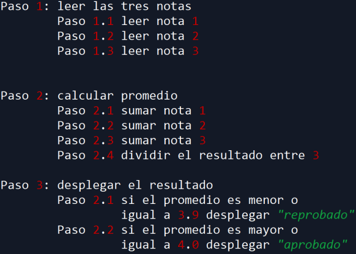

# Ejercicio N°1

Como ejercicio se les solicita realizar el programa que resuelva si un alumno esta reprobado o aprobado.

# Ejercicio N°2

* Genere un programa capaz de leer el nombre, mes (en número) y
año de nacimiento de dos personas.
* En caso de que las dos personas cumplan el mismo mes y año se
debe imprimir: “Wow, [Nombre1] y [Nombre2] cumplen el mismo
mes y año”, donde [Nombre1] y [Nombre2] son los nombres
introducidos para cada una de las personas.
* Si cumplen el mismo mes solamente, debe imprimirse: “Cumplen el
mismo mes, pero [NombreMayor] es más experimentado que
[NombreMenor]”, donde [NombreMayor] es el nombre de la
persona con mayor edad y [NombreMenor] el nombre de la menor.
* Si cumplen solamente el mismo año se debe imprimir “[Nombre1] y
[Nombre2] tienen edades muy similares, pero con [MesCnt] meses
de diferencia”, donde [MesCnt] es la diferencia de meses entre las
2 personas.
* Si no coincide el mes ni el año debe imprimirse: “Sus fechas de
nacimiento no están muy relacionadas”.
