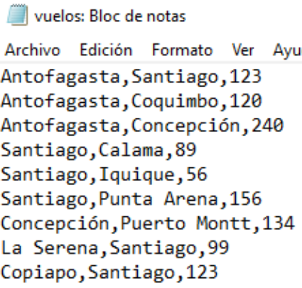
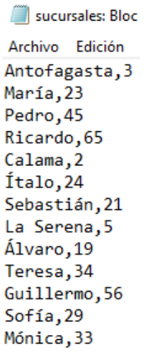
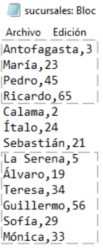

# Ejercicio N°1

En este archivo tenemos la información de vuelos donde aparece por cada registro:
* Ciudad origen
* Ciudad destino
* Cantidad de pasajeros transportados

Según el archivo vuelos. Crea un programa que determine lo
siguiente:
1. Cantidad total de vuelos realizados
2. Cantidad de vuelos realizados hacia la ciudad de Santiago
3. Promedio de pasajeros transportados en los vuelos cuyo origen
fue Antofagasta o Santiago
4. ¿Cuál fue el nombre de la ciudad de destino a la cual se
transportaron más pasajeros? Considera que es una sola
5. ¿Cuál fue el nombre de la ciudad de origen desde donde salieron
menos pasajero? Considera que es una sola
6. Porcentaje de vuelos que transportaron menos de 100 personas
con respecto al total de vuelos.

# Ejercicio N°2

Este archivo contiene la información de los empleados (nombre y edad) de las sucursales de
Antofagasta, Calama y La Serena.

Observa con atención, en la sucursal de Calama hay dos trabajadores:

* Ítalo con 24 años
* Sebastián con 21 años

Ahora debes utilizar el número de trabajadores para controlar otro ciclo.

Según el archivo sucursales. Crea un programa que determine lo
siguiente:
1. El nombre de la sucursal que tiene la mayor cantidad de
empleados. Suponga que existe solo una.
2. Promedio de edad de trabajadores de cada sucursal
3. El nombre del empleado con la edad mayor entre todas las
sucursales.
4. Porcentajes de empleados cuya edad se encuentra entre 25 y 30
años (ambos inclusive)
5. El nombre del empleado que tiene 33 años. Además se debe
desplegar en qué sucursal trabaja.
6. Desplegar la sucursal con la ponderación menor. La ponderación
de cada sucursal se calcula de la siguiente manera:
Número de empleados * 10 +
promedio de edad de sus trabajadores * 0,5
