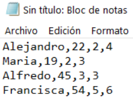
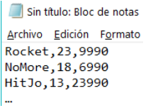

# Ejercicio N°1
Desarrolle un conversor de unidades para km, m y cm. Su algoritmo recibirá un
valor y una unidad de medida, luego debe recibir la unidad de medida a la cual
quiere convertir. Su algoritmo debe ser capaz de reconocer cuando no le pasan
una unidad de medida válida.

# Ejercicio N°2
Una pequeña empresa de alimento de mascotas necesita llevar a cabo un
análisis estadístico con respecto a los productos que está vendiendo, para esto
se solicita crear una aplicación que sea capaz de llevar el registro de cada
cliente que compra en la tienda y saber qué tipo de alimento llevará (Perro,
Gato, otro), además de los kilos que comprará. En el caso de los alimentos de
Gato, estos pueden ser de la marca “Purina” o “MasterCat”
No es necesario sacar cálculos de total de precio, ya que, solo nos interesan los datos
solicitados a continuación:
* El cliente que compro la mayor cantidad de kilos de alimentos, mostrando su nombre, tipo
de alimento y cantidad de kilos comprados.
* El cliente que compro la menor cantidad de kilos de alimentos, mostrando su nombre, tipo
de alimento y cantidad de kilos comprados
* El promedio de kilos de alimento para gatos de la marca “Purina” comprados
* El porcentaje de la cantidad de veces que se compró otro tipo de alimento, respecto al
total de alimentos

# Ejercicio N°3
El servicio de Registro Civil de Antofagasta ha detectado una serie de inconsistencias relacionadas con
datos provenientes de la reciente aplicación de la Ley de Tenencia Responsable de Mascotas.
Específicamente, los empleados del servicio obtenían regularmente datos de los dueños y mascotas
mediante la información que ellos mismo proveían al momento de inscribir un animal; sin embargo, los
funcionarios no tardaron en darse cuenta de que, en algunos casos, la información entregada por
parte de los dueños no era completa ni del todo fidedigna.
Dado lo anterior, el Registro Civil por primera vez hizo uso de su grupo altamente entrenado de espías
para determinar la situación real de todos los dueños que habían mentido en sus declaraciones.
Básicamente, su objetivo era detectar a los dueños que tuvieran más mascotas de las que hubieran
inscrito, para así cobrar las multas correspondientes. Se ha establecido una multa de treinta mil pesos
($30.000) por cada mascota que no se encuentre debidamente inscrita.
Una vez terminado el proceso de espionaje, el encargado de registrar los datos, confeccionó un
archivo de texto con toda la información obtenida. El archivo (“datos.txt”) está compuesto por cuatro
campos, todos separados por comas. Los campos son los siguientes:
* Nombre: nombre del dueño.
* Edad: edad del dueño.
* cantidadMascotas: cantidad de mascotas inscritas inicialmente por el dueño.
* cantidadMascotasReales: cantidad de mascotas que posee realmente el dueño. Este es el dato
que se obtiene luego del espionaje.

A modo de ejemplo, a continuación, se ilustra un posible archivo con
estas condiciones.

Este archivo indica que Alejandro inscribió legalmente a 2 mascotas,
pero en realidad tiene 4 mascotas, por lo cual existen dos mascotas
que no se han inscrito, y se cursará una multa de 60 mil pesos
(2 x $30.000).
Teniendo en consideración lo expuesto anteriormente, se le ha
pedido que implemente un programa en Python que sea capaz de
determinar las siguientes estadísticas:
1.La cantidad total de infractores a la Ley de Tenencia Responsable de Mascotas.
2.El promedio de edad de los infractores.
3.El promedio de mascotas no inscritas entre todos los infractores.
4.El nombre del dueño con el mayor número de mascotas no inscritas.
5.El nombre del dueño con el menor número de mascotas no inscritas.
6.El nombre de la persona con más edad entre los dueños no infractores.
7.La recaudación total por concepto de multas cursadas.

# Ejercicio N°4
Se tiene el archivo de texto llamado “albumes.txt” que contiene por cada línea del
archivo el nombre del álbum, la cantidad de canciones que tiene y su precio.
Un ejemplo del archivo podría ser el siguiente:
Según los datos del archivo “álbumes.txt” cree un programa en Python que
cumpla con los siguientes requisitos:
1. Desplegar cuántos álbumes hay en total
2. Cantidad promedio de canciones
3. Desplegar el nombre del álbum que posee menos de 15 canciones y su precio es
inferior o igual a $10.000. Considere que es solo uno.
4. Porcentaje de canciones del álbum con el menor precio con respecto al total de
canciones de todos los álbumes.

# Ejercicio N°5
Dado un archivo con N registros, construya un programa
que busque una palabra ingresada por el usuario dentro
del archivo, si la encuentra debe enviar un mensaje que
diga “logrado” en caso de que la palabra no se encuentre
debe solicitar que se vuelva a ingresar una nueva palabra
para buscar.